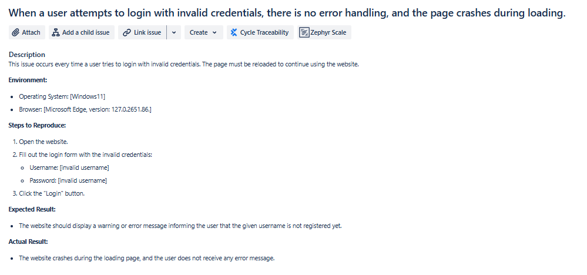

# Selenium-based Tests with Cucumber and Page Object Model
This project contains automated tests for the El-Proyecte-Grande 1.4 application using Selenium, Cucumber, and the Page Object Model.

## Table of Contents
- [Team Members](#team-members)
- [Technologies](#technologies)
- [Prerequisites](#prerequisites)
- [Test Cases](#test-cases)
- [Known Issues](#known-issues)

## Team Members
- [Ádám Mészáros](https://github.com/adesz0112)
- [Martin Árva](https://github.com/arvamartin)

## Technologies
The project utilizes the following technologies and tools:

- Java: The programming language used for writing test scripts.
- Apache Maven: A build automation tool used for project management and dependency management.
- JUnit: A testing framework for Java used to write and run tests.
- Selenium WebDriver for controlling web browsers (in this case, Microsoft Edge(126.0.2592.113))
- Cucumber
- Page Object Model (POM) design pattern

## Prerequisites
Before running the tests, ensure you have the following installed:

- Java Development Kit (JDK) 8 or higher
- Maven
- Edge WebDriver (or WebDriver for your preferred browser)

## Test Cases
The test cases cover various scenarios of the el-proyecte-grande 1.4 application, including:
- Registration functionality
- Login functionality
- Logout functionality
- Post functionality
- Nightmode functionality

## Known Issues
The project currently has the following known issues:
 
These issues are listed in the project's task board in the "TO DO" column and are awaiting resolution.

## Test Details
For detailed information on each test scenario, refer to the feature files under `src/test/resources/features`.

